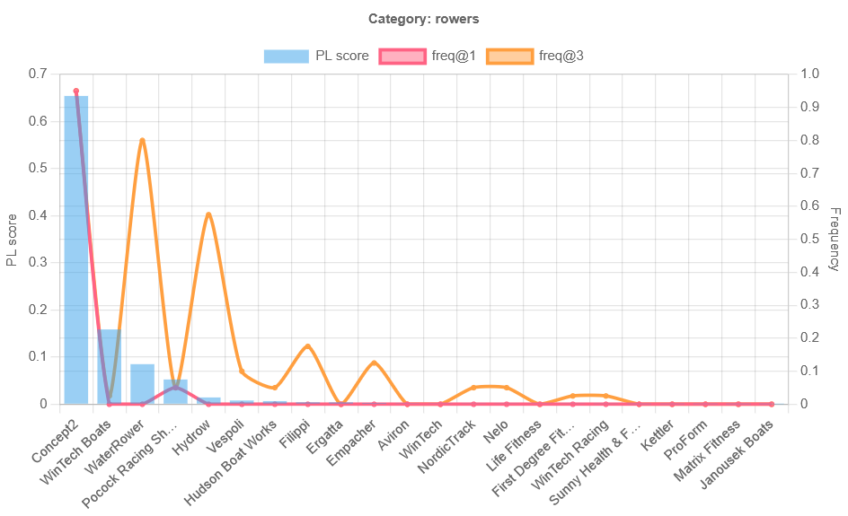
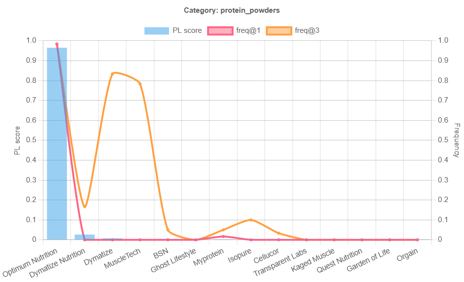
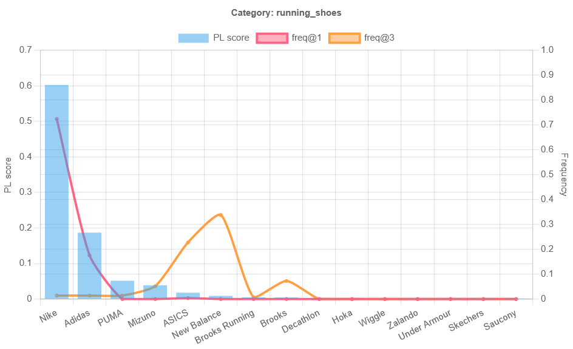
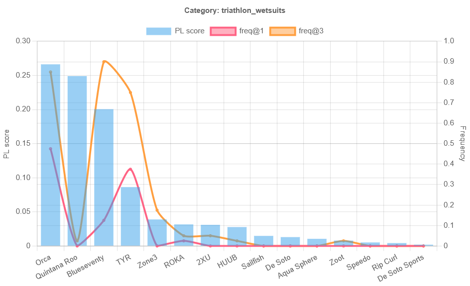
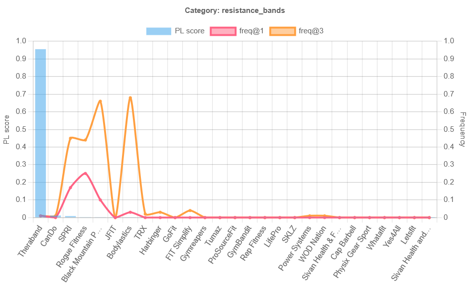
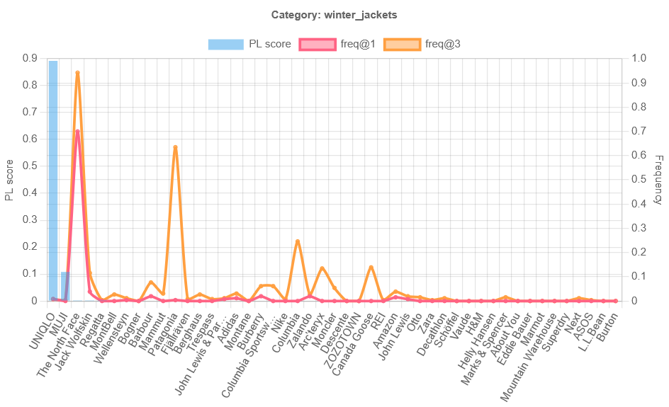
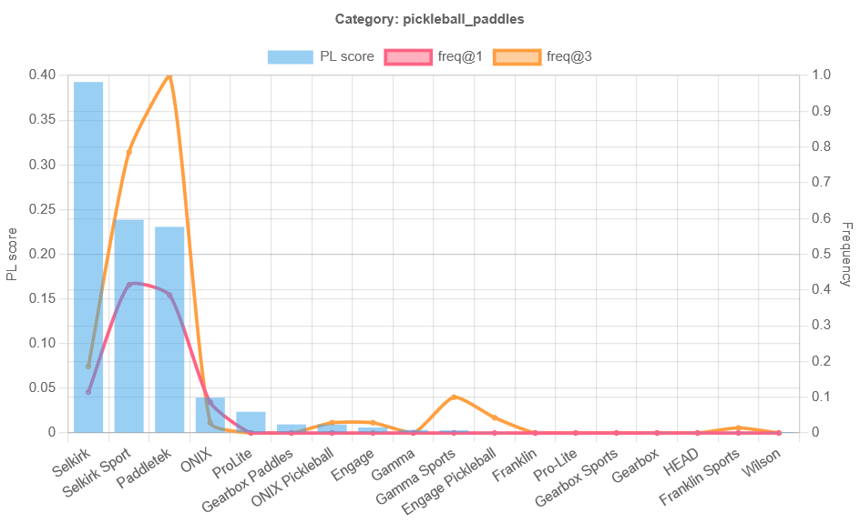
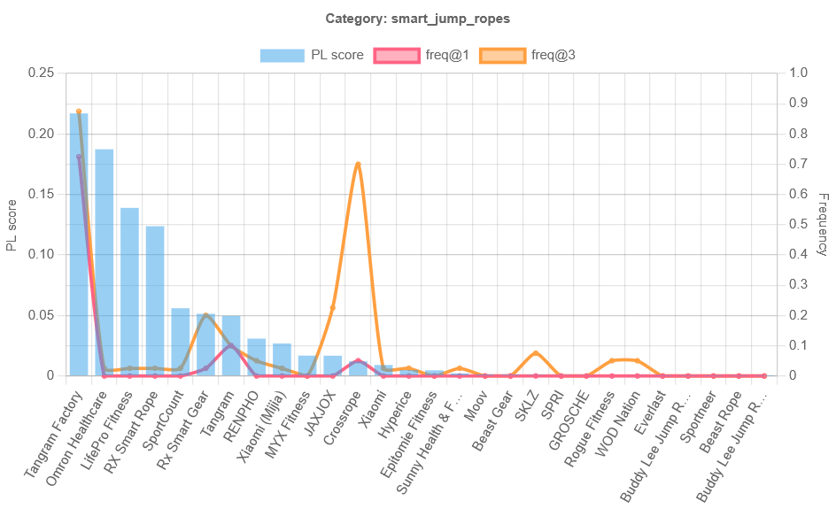

# RankLens Entity Evaluator: Conditioned Probing with Resampling
**Entity-conditioned probing with resampling** — PHP 7.4 CLI toolkit implementing standardized prompts, structured outputs, k-sampling, and Bradley–Terry aggregation.

- **PHP**: PHP 7, no jQuery required. CLI only.
- **Libraries**: guzzlehttp/guzzle, opis/json-schema, league/csv, math-php.
- **Data**: Final aggregation product (PL scores, frequency metrics, CIs) from 15,600 GPT-5 prompts (No Cache)

## Executive Summary
This repository provides a transparent demonstration of the RankLens Entities evaluation process used in SEO Vendor’s patent-pending system for large-language-model ranking analysis.
- **Goal.** Compare **PL scores (α=0.2, BT=300)** with **frequency baselines** (@1/@3) to surface category leaders and quality–popularity gaps.
- **Coverage.** 52 categories; global + per-locale (US/GB/DE/JP).
- **Sensitivity.** α/BT variants only reshuffle near cutlines → treat as ties.
- **Deliverables.** CSVs + viewer; see **Data**.

### Categories (52)
- adjustable_dumbbells
- alpine_boots
- base_layers
- basketball_apparel
- basketball_hoops
- basketball_shoes
- compression_leggings
- compression_shorts
- creatine_monohydrate
- cross_training_shoes
- down_jackets
- ellipticals
- fitness_trackers
- foam_rollers
- football_boots
- golf_apparel
- golf_rangefinders
- golf_shoes
- headlamps
- hiking_boots
- indoor_soccer_shoes
- light_hiking_shoes
- max_cushion_running_shoes
- merino_socks
- pickleball_paddles
- protein_powders
- racing_flats
- rain_jackets
- resistance_bands
- road_running_shoes
- rowers
- running_shoes
- running_socks
- smart_jump_ropes
- soccer_cleats
- spin_bikes
- sports_bras
- sports_water_bottles
- sunglasses_for_running
- swim_goggles
- tennis_apparel
- tennis_rackets
- tennis_shoes
- trail_backpacks
- trail_hiking_boots
- trail_running_shoes
- treadmills
- triathlon_wetsuits
- winter_jackets
- yoga_blocks
- yoga_mats
- yoga_towels

## Final Aggregates

These CSVs contain Plackett–Luce (PL) and frequency statistics for each category.
- **pl_rank**: Rank by PL mean score (lower is better)
- **pl_score**: Estimated worth (normalized)
- **pl_ci_low / pl_ci_high**: 95 % bootstrap confidence interval
- **freq_top1 / freq_top3**: Share of times the brand appeared in top 1 or top 3 positions
- **_ci**: Approx. bootstrap confidence width for the frequency metric

All scores derived from canonicalized data in `/data/results.canonical.jsonl`
using `php bin/aggregate.php`

## Category Case Studies (PL vs Popularity)

Below we highlight eight representative categories that illustrate distinct agreement/disagreement patterns between **PL** (our Bradley–Terry/Plackett–Luce worth) and **popularity** (frequency@1/@3). These cases are drawn from final data results (global). Unless stated otherwise, interpret reshuffles near cutlines as statistical ties.

### 1. Consensus leader
**Rowers.** Figure 1 shows a textbook consensus: **Concept2** dominates on PL and also leads in popularity; the remainder forms a second tier (e.g., WaterRower, NordicTrack). This is the ideal “quality aligns with popularity” scenario.

**Figure 1. Rowers — consensus leader.**  
  
*PL crowns Concept2 and frequency@1/@3 agree; remaining brands form a distant pack.*

---

### 2. Extreme dominance
**Protein powders.** Figure 2 captures an extreme case: **Optimum Nutrition** nearly saturates PL and wins popularity. The rest of the market drops off when a single “default” brand is dominate.

**Figure 2. Protein powders — extreme dominance.**  
  
*A single brand (Optimum Nutrition) dominates PL and frequency, with a very long tail.*

---

### 3. PL ≠ popularity (divergence)
**Running shoes.** Figure 3 shows divergence: a PL leader (e.g., **Nike**) coexists with shortlist momentum around **Brooks/ASICS** in frequency@3.

**Figure 3. Running shoes — PL vs popularity divergence.**  
  
*Quality (PL) favors one brand while users shortlist others.*

---

### 4. Tight race / overlapping leaders
**Triathlon wetsuits.** Figure 4 exhibits a compact top cluster (**Orca**, **Quintana Roo**, **BlueSeventy**). With overlapping uncertainty, these are practical ties; policy should avoid over-interpreting small gaps.

**Figure 4. Triathlon wetsuits — tight race.**  
  
*A 2–3 brand pack with overlapping PL uncertainty—treat as statistical ties near the cutline.*

---

### 5. Long tail + alias risk
**Resistance bands.** Figure 5 shows **TheraBand** as the PL leader, while popularity drops across rivals (e.g., SPRI, Bodylastics). The shape also reveals potential substitution pitfalls—worth expanding on.

**Figure 5. Resistance bands — long tail (and alias risk).**  
  
*Clear PL leader but fragmented popularity; prioritize alias cleanup and a tight top-N.*

---

### 6. Regional/retailer bias
**Winter jackets.** Figure 6 illustrates preference splits likely driven by locale/retailer exposure: PL favors **UNIQLO**, while frequency@1 spikes on **The North Face**. This is a good reminder that popularity is not the same as factors such as quality.

**Figure 6. Winter jackets — regional/retailer effects.**  
  
*PL and popularity point to different leaders; likely influenced by regional/retailer footprint.*

---

### 7. Defined podium
**Pickleball paddles.** Figure 7 presents a clean top-3 (e.g., **Selkirk**, **Paddletek**, **ONIX**) that’s consistent across PL and frequency@3. This is where a fixed cutline with stable recommendations works well.

**Figure 7. Pickleball paddles — clear podium.**  
  
*A stable top-3 across PL and frequency; well-suited to a fixed recommendations set.*

---

### 8. Fragxmented market / no winner
**Smart jump ropes.** Figure 8 shows no dominant PL leader and scattered frequency spikes. In such categories, widen coverage and favor specific situations over hard defaulting.

**Figure 8. Smart jump ropes — fragmented field.**  
  
*Low, diffuse PL with sporadic popularity spikes—prefer broader coverage and exploration.*

---
## Layout
```
bin/
  probe.php           # run k samples/entity and write JSONL
  aggregate.php       # compute Bradley–Terry scores + Spearman and export CSV
src/
  Client/LLMClient.php
  Prompt/Template.php
  Schema/Validator.php
  Canon/BrandMap.php
  Rank/BradleyTerry.php
  Stats/Spearman.php
  Stats/Bootstrap.php
data/
  entities.sample.jsonl
  results.sample.jsonl
  pi-top/...
tests/
  unit/...
.github/workflows/
  php.yml             # CI with PHPUnit
```
## Quickstart
```bash
composer install
php bin/probe.php --entities data/entities.sample.jsonl --out data/results.sample.jsonl --k 100 --n 10 --temperature 0.5
php bin/aggregate.php --in data/results.sample.jsonl --out data/scores.csv
```
## Notes
- Replace LLMClient::call() with your vendor API using **structured outputs** (JSON Schema in `Schema/Validator.php`).
- Bradley–Terry implementation uses MM updates; Spearman ρ via MathPHP fallback when installed.
- Add your alias rules to `Canon/BrandMap.php`.


### Choose aggregation method
Bradley–Terry (default):
```bash
php bin/aggregate.php --in data/results.sample.jsonl --out data/scores_bt.csv --method bt
```

Plackett–Luce (listwise):
```bash
php bin/aggregate.php --in data/results.sample.jsonl --out data/scores_pl.csv --method pl
```

## Licensing

- **Code:** Apache-2.0 (c) 2025 SEO VENDOR LLC.  
- **Data:** CC BY 4.0  

> **Patent & License Notice**  
> Portions of this repository implement methods described in U.S. Patent Application No. 18/922,789, “LARGE LANGUAGE MODEL RANKING GENERATION AND REPORTING SYSTEM.”  
> Use of this code does **not** grant rights under that patent or any continuations.  
> See [LICENSE](LICENSE), [NOTICE](NOTICE), and [PATENT.md](PATENT.md) for full details.
